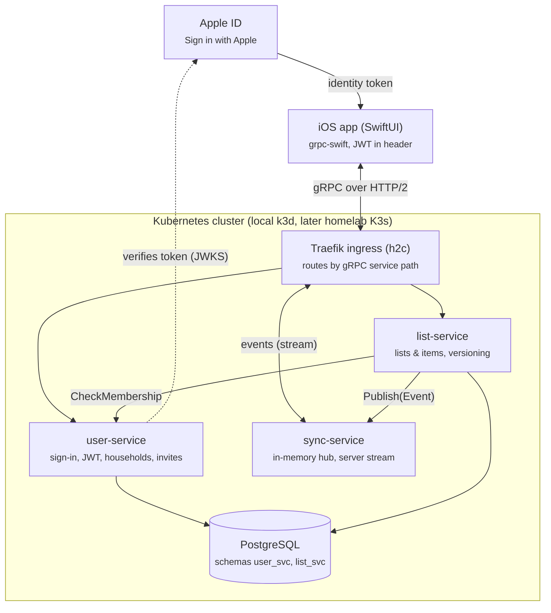

# Zettel – Project Plan & Architecture

Zettel is a shared household shopping list. The backend is three Go services that talk gRPC, the client is a SwiftUI iOS app, and everything runs on Kubernetes. At 3–5 hours per week, the MVP is done after 13 two-week sprints, at the end of April 2027.

## Contents

1. [Overview](#overview)
2. [Architecture](#architecture)
3. [Modules & repository layout](#modules--repository-layout)
4. [API design](#api-design)
5. [Data model](#data-model)
6. [Tech stack & conventions](#tech-stack--conventions)
7. [Deployment](#deployment)
8. [Sprint plan](#sprint-plan)
9. [Backlog & later ideas](#backlog--later-ideas)
10. [GitHub Project setup](#github-project-setup)
11. [Architecture decisions & open questions](#architecture-decisions--open-questions)

---

## Overview

**What the MVP must do**

- Sign in with an Apple ID
- Create a household and add members with an invite code
- Several lists per household, e.g. "Weekly groceries" and "Drugstore"
- Add, edit, check off and delete items
- Changes appear instantly on every device in the household

**Explicitly out of scope for the MVP**

- Offline mode with conflict resolution
- Push notifications, widgets, Siri
- Android or web client
- Categories, prices, sorting by store aisle

**Constraints**

| Topic | Decision |
| --- | --- |
| Time budget | 3–5 h per week, i.e. 6–10 h per sprint |
| Sprint length | 2 weeks, first sprint starts Mon 2026-10-12, break 2026-12-21 – 2027-01-03 |
| Ticket size | S ≈ 1 h, M ≈ 2–3 h; anything bigger gets split |
| Code | All Go code is written by hand; this plan provides interfaces, structure and acceptance criteria |
| Environments | Local k3d; the homelab K3s cluster from sprint 11 |
| Sign-in | Sign in with Apple plus self-issued JWTs; a dev login for testing until sprint 10 |

---

## Architecture

Three Go services sit behind a Traefik ingress: **user-service** for sign-in and households, **list-service** for lists and items, **sync-service** for live updates. Only list-service calls other services.



Public RPCs are reachable through Traefik; `CheckMembership` and `Publish` stay inside the cluster.

### Flow: sign in

1. The app obtains an identity token from Apple.
2. It calls `SignInWithApple` on user-service.
3. user-service verifies the token against Apple's public keys (JWKS) and creates the user if new.
4. Response: access JWT (15 min) and refresh token (30 days).
5. Every further call carries `authorization: Bearer …`. Every service verifies the JWT with the public key; only user-service holds the private key.

### Flow: add an item

1. The app calls `AddItem` on list-service.
2. list-service asks user-service via `CheckMembership` whether the user belongs to the household.
3. It stores the item with `version = 1`.
4. It reports the change to sync-service via `Publish`.
5. sync-service sends the event to every open `Subscribe` stream of that household.
6. The other devices update their list without reloading.

---

## Modules & repository layout

One monorepo with a single Go module: three services share a small platform core under `internal/platform`. Generated code lives in `gen/` and is committed.

```text
zettel/
├── proto/zettel/
│   ├── user/v1/user.proto
│   ├── list/v1/list.proto
│   └── sync/v1/sync.proto
├── gen/go/                    # generated by buf
├── cmd/
│   ├── user-service/main.go
│   ├── list-service/main.go
│   └── sync-service/main.go
├── internal/
│   ├── platform/              # shared core
│   │   ├── config/
│   │   ├── logging/
│   │   ├── grpcserver/
│   │   ├── auth/
│   │   └── postgres/
│   ├── user/
│   ├── list/
│   └── sync/
├── migrations/
│   ├── user/
│   └── list/
├── deploy/
│   ├── k3d/cluster.yaml
│   └── kustomize/
│       ├── base/
│       └── overlays/{local,homelab}/
├── ios/Zettel/                # SwiftUI app
├── docs/adr/
├── buf.yaml
├── buf.gen.yaml
├── Makefile
└── go.mod                     # github.com/timkrebs/zettel
```

**Modules and responsibilities**

| Module | Responsibility | Depends on |
| --- | --- | --- |
| `platform/config` | Load env vars into a struct, validate required values | – |
| `platform/logging` | slog JSON logger, logging interceptor | – |
| `platform/grpcserver` | Start server, health, reflection, interceptor chain, graceful shutdown | logging |
| `platform/auth` | Issue and verify JWTs, unary and stream interceptors, user ID in context | config |
| `platform/postgres` | pgx pool, migrations on startup | config |
| `user` | Accounts, sign-in, tokens, households, invites | platform, Apple JWKS |
| `list` | Lists and items, authorization, versioning | platform, user client, sync client |
| `sync` | Event hub, streams to devices | platform |

**Layers inside a service** (e.g. `internal/list`)

1. `handler.go` – implements the gRPC server, validates input, maps proto ↔ domain, maps errors to status codes
2. `service.go` – business logic, e.g. "only members may change items"
3. `repository.go` – interface for persistence
4. `postgres.go` – repository implementation with pgx
5. `model.go` – domain types, independent of generated proto code

Dependencies only point down: handler → service → repository. That way the service can be tested with a fake repository.

---

## API design

Every service has a versioned proto package (`zettel.<service>.v1`) with one public and, where needed, one internal gRPC service. Only public services are routed through the ingress.

**Conventions**

- Auth via metadata `authorization: Bearer <jwt>`; the only exceptions are the sign-in RPCs
- Dedicated request/response messages per RPC (`CreateListRequest`, `CreateListResponse`), as buf lint requires
- Never reuse field numbers; mark removed fields as `reserved`
- IDs are UUIDs as `string`, timestamps are `google.protobuf.Timestamp`
- Errors: `InvalidArgument` for bad input, `Unauthenticated` without a valid token, `PermissionDenied` without membership, `NotFound`, `Aborted` on version conflicts

**zettel.user.v1**

| RPC | Purpose | Reachable |
| --- | --- | --- |
| `DevSignIn` | Sign in with a display name only, only when `ZETTEL_DEV_LOGIN=true` | public, no token |
| `SignInWithApple` | Verify Apple identity token, create user, issue tokens | public, no token |
| `RefreshToken` | New token pair for a refresh token; the old one is revoked | public, no token |
| `GetMe` | Own profile | public |
| `CreateHousehold` | Create household, creator becomes owner | public |
| `ListMyHouseholds` | The user's households | public |
| `CreateInvite` | Create invite code, 8 characters, valid 48 h, single use | public |
| `AcceptInvite` | Join a household with a code | public |
| `ListMembers` | Members of a household | public |
| `LeaveHousehold` | Leave a household; the last owner cannot leave | public |
| `MembershipService.CheckMembership` | Is user X a member of household Y? | internal only |

**zettel.list.v1**

| RPC | Purpose |
| --- | --- |
| `CreateList` | Create a list in a household |
| `ListLists` | All non-archived lists of a household |
| `RenameList` | Rename, with `expected_version` |
| `ArchiveList` | Archive instead of delete |
| `ListItems` | Items of a list, optionally without checked ones |
| `AddItem` | Item with name, optional quantity and note |
| `UpdateItem` | Change name, quantity, note, with `expected_version` |
| `SetItemChecked` | Check or uncheck, with `expected_version` |
| `DeleteItem` | Delete an item (soft delete) |

**zettel.sync.v1**

| RPC | Purpose | Reachable |
| --- | --- | --- |
| `SyncService.Subscribe` | Server stream with all events of a household | public |
| `SyncInternalService.Publish` | list-service reports a change | internal only |

The event carries enough data for the app to update without reloading:

```protobuf
message Event {
  string id = 1;
  string household_id = 2;
  string actor_user_id = 3;
  google.protobuf.Timestamp occurred_at = 4;
  oneof payload {
    ListUpserted list_upserted = 10;
    ListArchived list_archived = 11;
    ItemUpserted item_upserted = 12;
    ItemDeleted item_deleted = 13;
  }
}
```

---

## Data model

One Postgres database `zettel` with one schema and one DB role per service: `user_svc` and `list_svc`. There are no foreign keys across schemas; list-service knows households only by ID.

**Schema `user_svc`**

| Table | Columns | Notes |
| --- | --- | --- |
| `users` | id uuid PK, apple_sub text unique null, display_name text, created_at | `apple_sub` stays empty for dev sign-in |
| `refresh_tokens` | id uuid PK, user_id FK, token_hash bytea, expires_at, revoked_at null, created_at | Only the hash is stored |
| `households` | id uuid PK, name text, created_by uuid, created_at | |
| `household_members` | household_id FK, user_id FK, role text, joined_at; PK (household_id, user_id) | role: `owner` or `member` |
| `invites` | code text PK, household_id FK, created_by, expires_at, accepted_by null, accepted_at null | single use |

**Schema `list_svc`**

| Table | Columns | Notes |
| --- | --- | --- |
| `lists` | id uuid PK, household_id uuid, name text, version int, archived_at null, created_at, updated_at | Index on household_id |
| `items` | id uuid PK, list_id FK, name text, quantity text, note text, checked bool, checked_by uuid null, position int, version int, created_by, created_at, updated_at, deleted_at null | Soft delete via deleted_at |

**Optimistic locking:** every change runs as `UPDATE … SET version = version + 1 WHERE id = $1 AND version = $2`. If the update affects no row, the handler returns `Aborted` and the app reloads.

---

## Tech stack & conventions

The stack relies on the standard library and a few widely used packages, so you build the concepts yourself instead of configuring frameworks.

| Area | Choice | Why |
| --- | --- | --- |
| Language | Go, current stable release | – |
| RPC | `google.golang.org/grpc` | Reference implementation |
| Proto tooling | buf (lint, breaking, generate) | Replaces protoc scripts, detects breaking changes |
| Database | PostgreSQL with `jackc/pgx/v5`, hand-written SQL | Learn SQL and transactions directly |
| Migrations | `pressly/goose`, embedded via `go:embed` | Runs on startup, no extra job |
| JWT | `golang-jwt/jwt/v5` with Ed25519 | Small keys, only user-service signs |
| Apple sign-in | `MicahParks/keyfunc/v3` for Apple's JWKS | Keys are cached and rotated |
| Config | `caarlos0/env` | Env vars straight into a struct |
| Logging | `log/slog` (standard library) | JSON, fits Loki later |
| Tests | `testing`, `bufconn`, `testcontainers-go` | Handlers without network, repositories against real Postgres |
| Lint | golangci-lint | One tool, many linters |
| Container | Multi-stage build, `distroless/static` | Small, no shell |
| Local | k3d, kubectl, kustomize, grpcurl | k3d ships Traefik, like K3s in the homelab |
| iOS | SwiftUI, grpc-swift 2 | Clients generated from the same protos |

**Way of working**

- One branch per ticket, e.g. `feat/z-16-dev-sign-in`; PR with `Closes #<issue>`
- Commits follow Conventional Commits: `feat(user): add DevSignIn`
- Wrap errors with `%w`; domain errors become gRPC status codes only in the handler
- `context.Context` through all layers; outgoing calls always with a timeout
- Configuration only via env vars prefixed `ZETTEL_`

**Definition of Done**

- [ ] Ticket acceptance criteria met and demonstrated locally
- [ ] Tests for the new logic, `make test` green
- [ ] `make lint` and `buf lint` green
- [ ] README or ADR updated if behavior or setup changed

---

## Deployment

From sprint 7 Zettel runs entirely in a local k3d cluster and moves to the homelab K3s cluster in sprint 11 via a Kustomize overlay. Both use Traefik as ingress, so the manifests stay almost the same.

**Local (k3d)**

| Component | Implementation |
| --- | --- |
| Cluster | `deploy/k3d/cluster.yaml`: 1 server, 2 agents, local registry, port 8080 → Traefik |
| Ingress | Traefik IngressRoute with backend scheme `h2c`, routing by path prefix, e.g. `/zettel.list.v1.ListService/` → list-service:9090 |
| Internal RPCs | `MembershipService` and `SyncInternalService` get no route; reachable inside the cluster only |
| Postgres | One StatefulSet with a PVC; an init script creates schemas and roles |
| Probes | Native Kubernetes gRPC probes against the health service |
| Config | One ConfigMap per service; secrets via Kustomize `secretGenerator` from a local `.env` that is not committed |
| Resources | Requests 50m CPU / 64 Mi, limits 256 Mi per service |

**Makefile targets:** `cluster-up`, `cluster-down`, `images`, `deploy`, `logs`, `grpc-list`.

**Homelab (K3s, from sprint 11)**

| Component | Implementation |
| --- | --- |
| Images | GitHub Actions builds on every merge, tag = Git SHA, registry ghcr.io |
| Deploy | Job on the self-hosted runner applies the `homelab` overlay |
| Postgres | CloudNativePG operator with scheduled backups |
| Secrets | Kubernetes secrets first, from sprint 12 from Vault via the Vault Secrets Operator |
| External access | Open: gRPC through Cloudflare Tunnel is checked in a spike in sprint 11, the result becomes ADR-0007 |
| Observability | Metrics via ServiceMonitor to Prometheus, JSON logs to Loki, dashboard in Grafana |

---

## Sprint plan

13 sprints of 2 weeks with 65 tickets; each sprint is 8–11 hours and has a goal you can demo at the end. After sprint 6 the backend runs completely on your machine, after sprint 10 the app MVP is done.

Every ticket is a GitHub issue (`Z-01` … `Z-65`) with goal, acceptance criteria and hints. The full ticket data lives in [`scripts/github/tickets.json`](../scripts/github/tickets.json).

| Sprint | Dates | Goal | Milestone |
| --- | --- | --- | --- |
| 0 – Foundation | 2026-10-12 – 10-25 | An empty repo where `make lint test` passes locally and in CI | M1 |
| 1 – Platform core | 2026-10-26 – 11-08 | user-service starts, connects to Postgres, answers health checks, shuts down cleanly on SIGTERM | M1 |
| 2 – Dev sign-in | 2026-11-09 – 11-22 | Get a token via `DevSignIn` with grpcurl and call `GetMe` with it | M1 |
| 3 – Households | 2026-11-23 – 12-06 | Two dev users share a household via an invite code | M1 |
| 4 – list-service | 2026-12-07 – 12-20 | Household members manage lists via grpcurl; strangers get `PermissionDenied` | M1 |
| *Break* | 2026-12-21 – 2027-01-03 | | |
| 5 – Items | 2027-01-04 – 01-17 | Add, check off and delete items; concurrent changes end in `Aborted` instead of silent overwrites | M1 |
| 6 – Real-time sync | 2027-01-18 – 01-31 | Two grpcurl sessions see each other's changes live | M1 |
| 7 – Local Kubernetes | 2027-02-01 – 02-14 | The whole system runs in k3d and is reachable through Traefik via grpcurl | M2 |
| 8 – iOS basics | 2027-02-15 – 02-28 | The app signs in via dev login and shows households and lists from the k3d cluster | M3 |
| 9 – Lists & live updates in the app | 2027-03-01 – 03-14 | Two simulators edit the same list and see changes instantly | M3 |
| 10 – Sign in with Apple | 2027-03-15 – 03-28 | Sign-in via Apple only; expired tokens refresh silently | M3 |
| 11 – Homelab | 2027-03-29 – 04-11 | Zettel runs in the homelab K3s cluster and is reachable from outside | M4 |
| 12 – Operations & daily use | 2027-04-12 – 04-25 | Metrics and logs are visible, and the household uses Zettel via TestFlight | M4 |

---

## Backlog & later ideas

These items go into the GitHub Project with status "Backlog" and no sprint. They all build on the MVP.

| Idea | What you learn |
| --- | --- |
| NATS instead of the in-memory hub, several sync replicas | Messaging, horizontal scaling |
| suggestion-service: "You buy milk every 7 days" | New service, analysing history |
| Push notifications via APNs | External APIs, background jobs |
| Offline mode with a local queue | Conflict resolution, client persistence |
| Categories and sorting by store aisle | Extend the data model without breaking changes |
| Widget and Siri shortcut "Add milk" | App Intents, WidgetKit |
| NetworkPolicies: internal RPCs only from list-service | Kubernetes network security |
| OpenTelemetry tracing across services | Distributed tracing |
| GitOps with Argo CD or Flux | Declarative deployment |
| sqlc instead of hand-written SQL | Code generation for queries |
| Rate limiting for sign-in RPCs | Interceptors, abuse protection |

---

## GitHub Project setup

A GitHub Project "Zettel" (Projects v2), linked to this repository. Every ticket Z-01 to Z-65 is an issue with goal, acceptance criteria and a link back to this plan. The setup is scripted in [`scripts/github/bootstrap.py`](../scripts/github/bootstrap.py).

**Fields**

| Field | Type | Values |
| --- | --- | --- |
| Status | Single select | Backlog, Todo, In Progress, In Review, Done |
| Sprint | Iteration | 2 weeks from 2026-10-12, break 2026-12-21 – 2027-01-03 |
| Size | Single select | S (≈ 1 h), M (2–3 h) |
| Area | Single select | repo, proto, platform, user, list, sync, infra, deploy, ci, ios, docs, ops |

**Labels:** `type:feature`, `type:chore`, `type:spike`, `type:docs`, `type:bug`.

**Milestones**

| Milestone | Reached after | Due |
| --- | --- | --- |
| M1 – Backend complete locally | Sprint 6 | 2027-01-31 |
| M2 – Runs in k3d | Sprint 7 | 2027-02-14 |
| M3 – App MVP | Sprint 10 | 2027-03-28 |
| M4 – Ready for daily use in the homelab | Sprint 12 | 2027-04-25 |

**Views** (created by hand, the API cannot create views)

- **Board** – columns by Status, filtered to `sprint:@current`
- **Sprints** – table, grouped by Sprint, with the sum of sizes
- **Roadmap** – timeline using the Sprint field
- **Backlog** – all items with `status:Backlog`

**Automation** (built-in project workflows): new items → Todo, linked PR opened → In Review, merged/closed → Done.

---

## Architecture decisions & open questions

Six decisions are fixed and live as ADRs in [`docs/adr/`](adr/); ADR-0007 follows from the spike in sprint 11.

| ADR | Decision | Accepted trade-off |
| --- | --- | --- |
| [0001](adr/0001-monorepo-single-go-module.md) | Monorepo with one Go module for all services | All services share dependency versions |
| [0002](adr/0002-grpc-through-ingress-no-gateway.md) | The app talks gRPC directly through Traefik, no dedicated API gateway; every service verifies the JWT itself | Auth logic runs in every service, hence a shared package |
| [0003](adr/0003-in-memory-sync-hub.md) | Live sync via an in-memory hub in sync-service with exactly one replica; list-service reports changes via gRPC | Events are lost on restart; the app reloads after reconnect. Scale later with NATS |
| [0004](adr/0004-one-postgres-schema-per-service.md) | One Postgres instance, one schema and one DB role per service | No foreign keys between services |
| [0005](adr/0005-optimistic-locking.md) | Optimistic locking via a `version` column, conflict → `Aborted` | The app must handle conflicts |
| [0006](adr/0006-own-jwts-with-sign-in-with-apple.md) | Own JWTs (Ed25519, 15 min) plus refresh tokens (30 days, rotated); Apple's token is only verified at sign-in | Revocation takes effect only when the access token expires |
| 0007 | External access | open, result of Z-56 |

**Open questions**

- [ ] iOS app in this monorepo under `ios/` (plan) or a separate repo?
- [ ] Apple Developer Program (paid) needed from sprint 10 for Sign in with Apple and TestFlight
- [ ] Does Cloudflare Tunnel handle gRPC streams reliably? Resolved by Z-56
